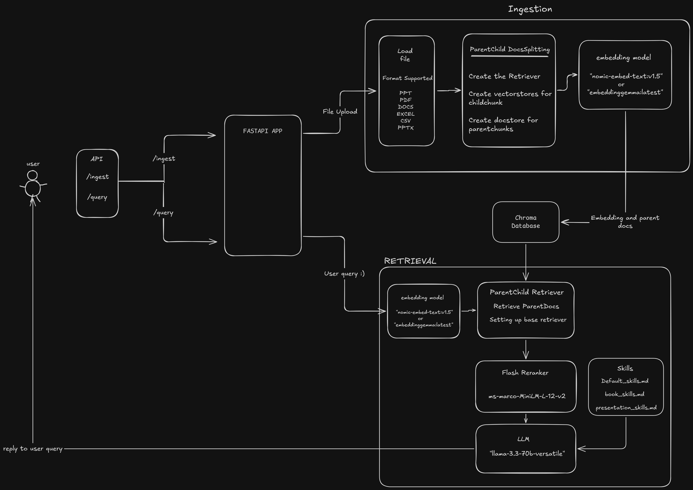

# RAG System with Parent Document Retrieval

A Retrieval-Augmented Generation (RAG) system that uses **Parent Document Retrieval** and **FlashrankRerank** to provide accurate answers from your PDF documents.

## Key Features

- **Parent Document Retrieval**: Searches using small chunks but retrieves larger parent chunks for better context
- **FlashrankRerank**: Improves result quality by reranking retrieved documents
- **Local Embeddings**: Uses Ollama's `embeddinggemma:300m` or use `nomic-embed-text:v1.5` model locally
- **Groq**: Powered by `llama-3.3-70b-versatile` for answer generation

## Prerequisites

- Python 3.12+
- [Ollama](https://ollama.com/) installed and running
- Groq API key

## Setup

1. **Clone the repository**
   ```bash
   git clone <your-repository-url>
   cd rag
   ```

2. **Create and activate a virtual environment**
   ```bash
   # Windows
   uv venv
   .\venv\Scripts\activate

   # macOS/Linux
   python3 -m venv venv
   source venv/bin/activate
   ```

3. **Install dependencies**
   ```bash
   uv sync
   ```

4. **Pull the Ollama embedding model**
   ```bash
   ollama pull embeddinggemma:300m or ollama pull nomic-embed-text:v1.5
   ```

5. **Set up environment variables**
   Create a `.env` file in the project root:
   ```
   GROQ_API_KEY=your-groq-api-key-here
   ```

6. **Add your documents**
   Place PDF files in the `data/` directory

## Usage

### 1. Ingest Documents

Run the pipeline to process your files:

```bash
uvicorn api:app --reload
```

This will:
- Upload the file in the endpoint http://127.0.0.1:8000/ingest
- Load all PDFs from `data/`
- Split them into parent chunks (2000 chars) and child chunks (400 chars)
- Create embeddings for child chunks using Ollama
- Store everything in ChromaDB at `db/`

### 2. Query Your Documents

Ask questions about your documents:

```bash
{
  "question": "string"
}
```

The system will:
- Ask the questions in the endpoint http://127.0.0.1:8000/query
- Search for relevant child chunks
- Retrieve parent chunks for context
- Rerank results using Flashrank
- Groq model uses the relevant skill to understand the context of the file 

## Architecture 



## Technologies

- **LangChain**: RAG orchestration
- **Ollama** (`embeddinggemma:300m or nomic-embed-text:v1.5`): Local embeddings
- **ChromaDB**: Vector database
- **Groq model** (`llama-3.3-70b-versatile`): LLM for generation
- **Flashrank**: Result reranking
- **FastAPI**: (Future) API endpoints

## Troubleshooting

- **Ollama connection error**: Make sure Ollama is running (`ollama serve`)
- **Google API error**: Verify your `GROQ_API_KEY` in `.env`
- **Empty results**: Ensure documents are properly ingested before querying